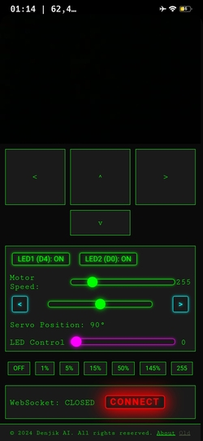

# ESP8266-RC-car-wifi-web-joy-and-esp32-cam-
Esp8266 rc car web 
# ESP8266 RC Car with Web Interface and Camera Control



This project implements a remote-controlled (RC) car using an ESP8266 microcontroller, with a web interface for control and live video streaming from an ESP32-CAM.

## Demo Video

[](https://www.youtube.com/watch?v=ZeWxeWNyQHM)

Click on the image above to watch the demo video of the ESP8266 RC Car in action!
## Features

- Full 4-wheel drive control
- Live video streaming
- Servo control for camera tilt
- LED control
- Web-based interface for easy control from any device

## Hardware Requirements

- ESP8266 microcontroller (for car control)
- ESP32-CAM (AI Thinker) for video streaming
- L298N motor driver
- Servo motor for camera tilt
- 4WD car chassis
- LEDs for additional lighting

## Software Setup

1. Flash the ESP8266 with the provided Arduino sketch (`car_new_style.ino`).
2. Update the Wi-Fi credentials in the code:
   ```cpp
   const char* ssid = "YourSSID";
   const char* password = "YourPassword";
   ```
3. Configure the correct pins for your L298N motor driver:
   ```cpp
   #define IN1_PIN D5
   #define IN2_PIN D3
   #define IN3_PIN D8
   #define IN4_PIN D7
   ```
4. Flash the ESP32-CAM with appropriate firmware for video streaming.
5. Connect the ESP32-CAM to the same network as the ESP8266.
6. Update the camera IP address in the web interface code:
   ```javascript
   const espHost = 'http://192.168.3.100';
   ```

## Usage

1. Power on the RC car and the ESP32-CAM.
2. Connect to the Wi-Fi network created by the ESP8266.
3. Open a web browser and navigate to the ESP8266's IP address.
4. Use the web interface to control the car, adjust the camera, and view the live stream.

## Contributing

Contributions to improve the project are welcome. Please feel free to fork the repository and submit pull requests.

## Acknowledgments

Special thanks to my daughter Nicole for inspiring this project!

---

# Радиоуправляемая машинка на ESP8266 с веб-интерфейсом и управлением камерой


Этот проект реализует радиоуправляемую машинку с использованием микроконтроллера ESP8266, веб-интерфейсом для управления и потоковой передачей видео с ESP32-CAM.

## Демонстрационное видео

[](https://www.youtube.com/watch?v=ZeWxeWNyQHM)

## Особенности

- Полный привод на 4 колеса
- Потоковая передача видео в реальном времени
- Управление сервоприводом для наклона камеры
- Управление светодиодами
- Веб-интерфейс для удобного управления с любого устройства

## Аппаратные требования

- Микроконтроллер ESP8266 (для управления машинкой)
- ESP32-CAM (AI Thinker) для потоковой передачи видео
- Драйвер двигателя L298N
- Сервопривод для наклона камеры
- Шасси машинки с полным приводом
- Светодиоды для дополнительного освещения

## Настройка программного обеспечения

1. Прошейте ESP8266 предоставленным скетчем Arduino (`car_new_style.ino`).
2. Обновите учетные данные Wi-Fi в коде:
   ```cpp
   const char* ssid = "ВашSSID";
   const char* password = "ВашПароль";
   ```
3. Настройте правильные пины для вашего драйвера двигателя L298N:
   ```cpp
   #define IN1_PIN D5
   #define IN2_PIN D3
   #define IN3_PIN D8
   #define IN4_PIN D7
   ```
4. Прошейте ESP32-CAM соответствующей прошивкой для потоковой передачи видео.
5. Подключите ESP32-CAM к той же сети, что и ESP8266.
6. Обновите IP-адрес камеры в коде веб-интерфейса:
   ```javascript
   const espHost = 'http://192.168.3.100';
   ```

## Использование

1. Включите питание RC машинки и ESP32-CAM.
2. Подключитесь к сети Wi-Fi, созданной ESP8266.
3. Откройте веб-браузер и перейдите по IP-адресу ESP8266.
4. Используйте веб-интерфейс для управления машинкой, регулировки камеры и просмотра прямой трансляции.

## Участие в проекте

Приветствуются вклады для улучшения проекта. Пожалуйста, не стесняйтесь форкать репозиторий и отправлять запросы на слияние.

## Благодарности

Особая благодарность моей дочери Николь за вдохновение для этого проекта!
